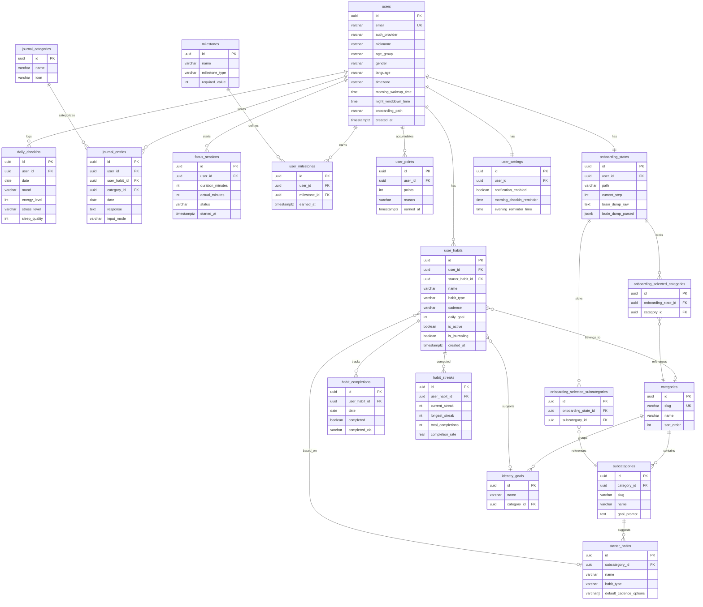

# Guided Growth — Database Schema ERD

> Based on `Plan/migration.sql` v4 — Supabase (PostgreSQL 15+)

## Entity Relationship Diagram

## Table Summary

| #   | Table                               | Purpose                              | RLS                      |
| --- | ----------------------------------- | ------------------------------------ | ------------------------ |
| 1   | `users`                             | User profiles & onboarding data      | ✅ Own row only          |
| 2   | `categories`                        | Habit taxonomy (seeded)              | Read-only for all        |
| 3   | `subcategories`                     | Habit sub-categories (seeded)        | Read-only for all        |
| 4   | `starter_habits`                    | Pre-defined habit templates (seeded) | Read-only for all        |
| 5   | `identity_goals`                    | Atomic Habits identity framework     | Read-only for all        |
| 6   | `user_habits`                       | User-created habits                  | ✅ Own habits            |
| 7   | `habit_completions`                 | Daily habit check-offs               | ✅ Via user_habits       |
| 8   | `habit_streaks`                     | Computed streaks & stats             | ✅ Via user_habits       |
| 9   | `daily_checkins`                    | Mood & wellness logs                 | ✅ Own check-ins         |
| 10  | `journal_categories`                | Journal categories (seeded)          | Read-only for all        |
| 11  | `journal_entries`                   | User journal entries                 | ✅ Own entries           |
| 12  | `focus_sessions`                    | Pomodoro-style sessions              | ✅ Own sessions          |
| 13  | `milestones`                        | Milestone definitions (seeded)       | Read-only for all        |
| 14  | `user_milestones`                   | User milestone achievements          | ✅ Own milestones        |
| 15  | `user_points`                       | Gamification points ledger           | ✅ Own points            |
| 16  | `onboarding_states`                 | Onboarding progress                  | ✅ Own state             |
| 17  | `onboarding_selected_categories`    | Onboarding picks                     | ✅ Via onboarding_states |
| 18  | `onboarding_selected_subcategories` | Onboarding picks                     | ✅ Via onboarding_states |
| 19  | `user_settings`                     | Notification preferences             | ✅ Own settings          |

## Storage Buckets

| Bucket             | Public | Max Size | Types                     |
| ------------------ | ------ | -------- | ------------------------- |
| `avatars`          | ✅     | 2MB      | JPEG, PNG, WebP           |
| `voice-recordings` | ❌     | 10MB     | WebM, MP4, MPEG, OGG, WAV |
| `exports`          | ✅     | 5MB      | PNG, JPEG, WebP           |
